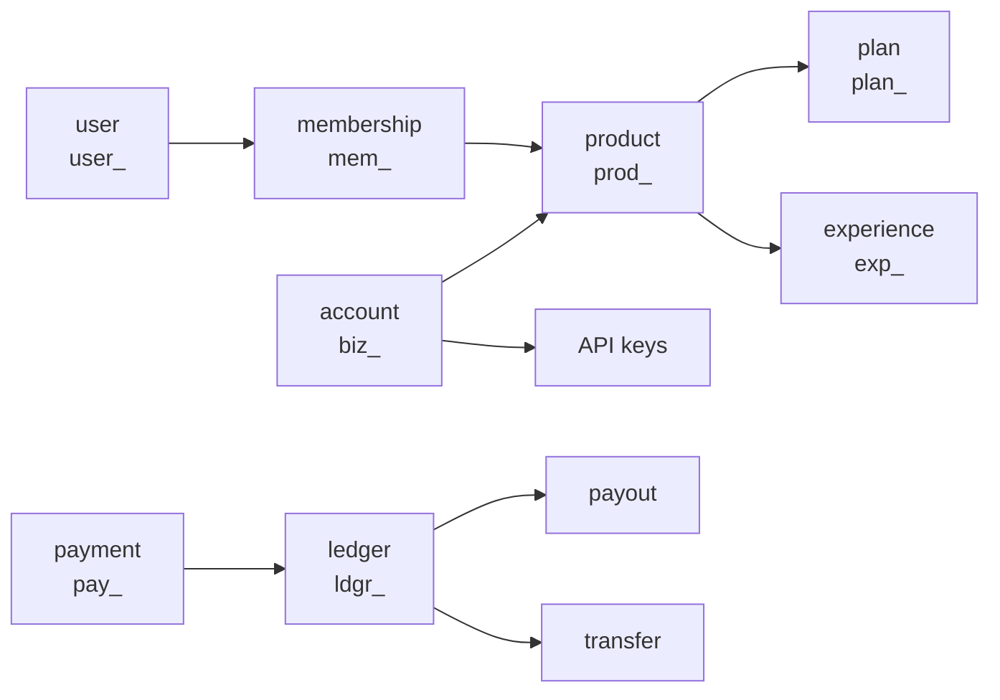

> ## Documentation Index
> Fetch the complete documentation index at: https://docs.whop.com/llms.txt
> Use this file to discover all available pages before exploring further.

# Core Concepts

> The objects Whop's API is built from: what each one is, what it's called, and how they connect.

Whop's API is a small number of objects that connect in predictable ways. This page defines each one, and says so plainly where an object goes by more than one name.

## Accounts and identity

<ResponseField name="account" type="biz_">
  A business on Whop. Owns API keys, products, webhooks, and money. See [Accounts](/api-reference/beta/accounts/account).
</ResponseField>

<ResponseField name="user" type="user_">
  A person with a Whop login. A user can buy from many accounts, and can also help run one. See [Users](/api-reference/beta/users/user).
</ResponseField>

<ResponseField name="team member">
  A user granted access to operate an account. Their role decides what they can do. See [Team members](/api-reference/beta/team-members/team-member).
</ResponseField>

<ResponseField name="member">
  A user seen as a customer: someone who holds or once held a membership to something the account sells. See [Members](/api-reference/beta/members/member).
</ResponseField>

### Connected account

An account you enroll and act for when you run a marketplace. You collect payments on its behalf and pay it out. Platform guides sometimes call this a sub-merchant. The two words mean the same object. The [platform quickstart](/developer/platforms/quickstart) walks the whole flow.

<ResponseField name="verification">
  The identity check an account clears before it can receive payouts. Individuals complete Know Your Customer (KYC) checks. Businesses complete Know Your Business (KYB) checks. See [Verifications](/api-reference/beta/verifications/verification).
</ResponseField>

<ResponseField name="identity profile" type="idpf_">
  The record of verified identity data a verification produces.
</ResponseField>

## What you sell

An account sells products. A product carries one or more plans, which set the price, and connects to the experiences a buyer actually gets.

<ResponseField name="product" type="prod_">
  A thing an account sells. Holds the description, the media, and the plans a buyer can choose from. See [Products](/api-reference/beta/products/product).
</ResponseField>

<ResponseField name="plan" type="plan_">
  One price and billing shape for a product: one-time or recurring, with an optional trial. A product can carry several. See [Plans](/api-reference/beta/plans/plan).
</ResponseField>

<ResponseField name="membership" type="mem_">
  What a buyer gets when they pay. Ties a user to a plan and carries a status telling you whether access is valid right now. See [Memberships](/api-reference/beta/memberships/membership).
</ResponseField>

### Experience

A unit of content or functionality inside what an account sells. A product connects to one or more experiences, and a membership to that product is what grants access to them.

This is Whop's most platform-specific noun and the one you can't guess from its name. If you are building an app that runs inside Whop, the experience is the thing your app renders into. See [App views](/developer/guides/app-views).

### Entitlement

The record that says a user may use a specific thing right now. Access is the question, and the entitlement is the stored answer. Check it against an account, a product, or an experience. See [Authentication](/developer/guides/authentication).

## How money moves

Money arrives, sits somewhere, then leaves. Every object below is one step along that path, in the order it happens.

<ResponseField name="checkout configuration" type="ch_">
  The reusable definition of a purchase: which plan, at what price, with what redirect. Produces a live checkout page. See [Checkout configurations](/api-reference/beta/checkout-configurations/checkout-configuration).
</ResponseField>

<ResponseField name="payment" type="pay_">
  One attempt to move money from a buyer to an account, carrying a status that says whether it worked.
</ResponseField>

<ResponseField name="charge">
  The same event described from the card network's side. The docs use both words. The API object is the payment.
</ResponseField>

### Ledger

The running record of every credit and debit on an account's money. It's the source of truth for what an account holds and what it's owed. Money lands in a ledger before it goes anywhere else. See [Ledger activity](/api-reference/beta/ledgers/ledger-activity).

<ResponseField name="balance">
  The amount sitting on a ledger right now that you can spend or withdraw.
</ResponseField>

<ResponseField name="reserve">
  A slice of a balance Whop holds back against future refunds and disputes. It releases on a schedule.
</ResponseField>

<ResponseField name="fee">
  Whop's cut of a payment, taken before the money reaches a balance.
</ResponseField>

<ResponseField name="deposit">
  Money added to a balance from outside Whop. See [Deposits](/api-reference/beta/deposits/deposit).
</ResponseField>

<ResponseField name="payout">
  Money leaving a balance for a bank account or wallet outside Whop. See [Payouts](/api-reference/beta/payouts/payout).
</ResponseField>

<ResponseField name="transfer">
  Money moving between two accounts inside Whop, without touching the outside world. See [Transfers](/api-reference/beta/transfers/transfer).
</ResponseField>

<ResponseField name="swap">
  A conversion of a balance between supported tokens, chains, or wallet destinations. See [Swaps](/api-reference/beta/swaps/swap).
</ResponseField>

<ResponseField name="card" type="icrd_">
  A Whop-issued virtual card that spends from an account or user balance. See [Cards](/api-reference/beta/cards/card).
</ResponseField>

<ResponseField name="refund">
  A completed payment returned to the buyer, initiated by you.
</ResponseField>

<ResponseField name="dispute">
  A payment reversed by the buyer's bank on their behalf. You can contest it. See [Disputes](/api-reference/beta/disputes/dispute).
</ResponseField>

## Building on Whop

<Info>
  **Platform** means two things in these docs. Whop-the-platform is the product you are integrating with. A platform in the marketplace sense is *you*, once you enroll connected accounts and take a cut of what they sell. The surrounding sentence tells you which is meant.
</Info>

<ResponseField name="app" type="app_">
  Software that runs inside Whop and reaches an audience through its marketplace. See [Apps](/api-reference/beta/apps/app).
</ResponseField>

<ResponseField name="app view">
  One screen an app renders inside Whop: the customer-facing experience view, or the creator-facing dashboard view. See [App views](/developer/guides/app-views).
</ResponseField>

<ResponseField name="iframe">
  How Whop embeds your app's pages in its own interface. Your app runs on your servers and renders inside Whop's chrome. See [iframe](/developer/guides/iframe).
</ResponseField>

<ResponseField name="permission">
  A single capability an API key is allowed to exercise. See [Permissions](/developer/guides/permissions).
</ResponseField>

### Scope

The same idea as a permission, but on an OAuth token: the set of things a user has agreed your app may do on their behalf. A permission is what your key can do. A scope is what a user let you do. See the [OAuth guide](/developer/guides/oauth).

<ResponseField name="OAuth grant">
  The record of a user approving your app for a set of scopes.
</ResponseField>

<ResponseField name="element">
  A prebuilt UI component Whop ships that you drop into your own product, so you don't build the interface yourself.
</ResponseField>

<ResponseField name="event">
  Something that happened in an account, like a payment succeeding.
</ResponseField>

<ResponseField name="webhook">
  The HTTP request Whop sends your server to tell you an event happened. See [Webhooks](/developer/guides/webhooks).
</ResponseField>

## Community

<ResponseField name="chat channel">
  A room where members send messages to each other. See [Chat](/developer/guides/chat/quickstart).
</ResponseField>

<ResponseField name="message">
  One post in a chat channel or a direct message.
</ResponseField>

<ResponseField name="forum">
  A threaded space for longer posts, separate from live chat. See [Forums](/developer/guides/forums).
</ResponseField>

<ResponseField name="forum post">
  One thread in a forum, with its replies, and its reactions.
</ResponseField>

<ResponseField name="notification">
  A message pushed to a user inside Whop. Each send is scoped to one experience or one user. See [Notifications](/developer/guides/notifications).
</ResponseField>

## Advertising

<ResponseField name="ad campaign" type="adcamp_">
  The top-level container for paid ads on an ad network. Sets the platform, the objective, and the budget strategy. See [Ad campaigns](/api-reference/beta/ad-campaigns/ad-campaign).
</ResponseField>

<ResponseField name="ad group" type="adgrp_">
  Sits inside a campaign and controls delivery: targeting, the optimization goal, and the schedule. See [Ad groups](/api-reference/beta/ad-groups/ad-group).
</ResponseField>

<ResponseField name="ad" type="ad_">
  The creative unit an ad group delivers: copy, assets, and the destination URL. See [Ads](/api-reference/beta/ads/ad).
</ResponseField>

<ResponseField name="audience">
  A customer list uploaded to Whop and used to target or exclude people in an ad group. See [Audiences](/api-reference/beta/audiences/audience).
</ResponseField>

## Referrals and rewards

<ResponseField name="affiliate" type="aff_">
  Someone who earns commission for sending buyers to a product. See [Affiliates](/developer/guides/affiliates).
</ResponseField>

<ResponseField name="partner">
  A user enrolled in Whop's partner program, earning on the businesses they refer onto Whop. See [Partners](/developer/partners/overview).
</ResponseField>

<ResponseField name="referred business" type="coma_">
  A business a partner brought onto Whop, carrying the commission rates and the referral window that apply to it.
</ResponseField>

<ResponseField name="partner earning">
  One commission line for a referred business, naming the income source it came from and its status.
</ResponseField>

<ResponseField name="bounty" type="bnty_">
  A paid task with its reward held in escrow from the moment it publishes. See [Bounties](/developer/bounties/overview).
</ResponseField>

<ResponseField name="bounty submission" type="btys_">
  One worker's attempt on a bounty, from the attempt through review, and on to payout.
</ResponseField>

## Environments and keys

Whop runs two environments. They share nothing.

|           | Sandbox     | Production |
| --------- | ----------- | ---------- |
| Money     | Never moves | Real       |
| Dashboard | Separate    | Separate   |
| Keys      | Own set     | Own set    |
| Data      | Test data   | Live data  |

See [Test in the sandbox](/developer/guides/sandbox) for how to switch.

<Warning>
  Sandbox and production keys look identical. Nothing in the key string tells you which environment it belongs to, so store them under different names and check before running anything that moves money.
</Warning>

Four credential types reach the API. Pick by whose data you need.

| Credential                | Acts as                      | Use when                                                                            |
| ------------------------- | ---------------------------- | ----------------------------------------------------------------------------------- |
| API key                   | Your account, or your app    | Your server works on your own business, or on every account that installed your app |
| Account-scoped user token | One user, inside one account | Your product has its own users and they reach Whop without a Whop sign-in           |
| iframe user token         | The user viewing your app    | Your app renders inside Whop and you need to know who is looking at it              |
| OAuth token               | A user who signed in to Whop | A user signed in and approved your app                                              |

See [Auth & API keys](/developer/guides/auth-scoping) for how to choose and scope each one.

<ResponseField name="Api-Version-Date">
  The header that pins your integration to a dated version of the API, so later changes don't alter the responses you built against. See [API versioning](/developer/api/versioning).
</ResponseField>

<ResponseField name="idempotency key">
  A value you attach to a `POST` so retrying it replays the original response instead of doing the work twice. See [Idempotent requests](/developer/api/idempotency).
</ResponseField>

## ID reference

Every object carries a prefixed ID. When you are staring at a payload, this table tells you what you are holding.

| Prefix    | Object                 | See                                                                                           |
| --------- | ---------------------- | --------------------------------------------------------------------------------------------- |
| `biz_`    | Account                | [Accounts](/api-reference/beta/accounts/account)                                              |
| `user_`   | User                   | [Users](/api-reference/beta/users/user)                                                       |
| `prod_`   | Product                | [Products](/api-reference/beta/products/product)                                              |
| `plan_`   | Plan                   | [Plans](/api-reference/beta/plans/plan)                                                       |
| `mem_`    | Membership             | [Memberships](/api-reference/beta/memberships/membership)                                     |
| `exp_`    | Experience             | [App views](/developer/guides/app-views)                                                      |
| `app_`    | App                    | [Apps](/api-reference/beta/apps/app)                                                          |
| `pay_`    | Payment                | [Overview](/api-reference/beta/overview)                                                      |
| `ch_`     | Checkout configuration | [Checkout configurations](/api-reference/beta/checkout-configurations/checkout-configuration) |
| `ldgr_`   | Ledger account         | [Ledger activity](/api-reference/beta/ledgers/ledger-activity)                                |
| `idpf_`   | Identity profile       | [Verifications](/api-reference/beta/verifications/verification)                               |
| `sacc_`   | Social account         | [Overview](/api-reference/beta/overview)                                                      |
| `aff_`    | Affiliate              | [Affiliates](/developer/guides/affiliates)                                                    |
| `adcamp_` | Ad campaign            | [Ad campaigns](/api-reference/beta/ad-campaigns/ad-campaign)                                  |
| `adgrp_`  | Ad group               | [Ad groups](/api-reference/beta/ad-groups/ad-group)                                           |
| `ad_`     | Ad                     | [Ads](/api-reference/beta/ads/ad)                                                             |
| `bnty_`   | Bounty                 | [Bounties](/developer/bounties/overview)                                                      |
| `btys_`   | Bounty submission      | [Bounties](/developer/bounties/overview)                                                      |
| `coma_`   | Referred business      | [Partners](/developer/partners/overview)                                                      |
| `icrd_`   | Card                   | [Cards](/api-reference/beta/cards/card)                                                       |
| `course_` | Course                 | [Overview](/api-reference/beta/overview)                                                      |
| `file_`   | File                   | [Overview](/api-reference/beta/overview)                                                      |

## Next steps

<Columns cols={2}>
  <Card title="Quickstart" icon="rocket" href="/developer/quickstart">
    Make your first API call in a few minutes.
  </Card>

  <Card title="Test in sandbox" icon="flask" href="/developer/guides/sandbox">
    Try everything against test data before going live.
  </Card>

  <Card title="API overview" icon="map" href="/api-reference/beta/overview">
    How requests, versioning, and pagination work.
  </Card>

  <Card title="What you can build" icon="signs-post" href="/developer/start">
    The full capability map, and the guide for what you're building.
  </Card>
</Columns>
